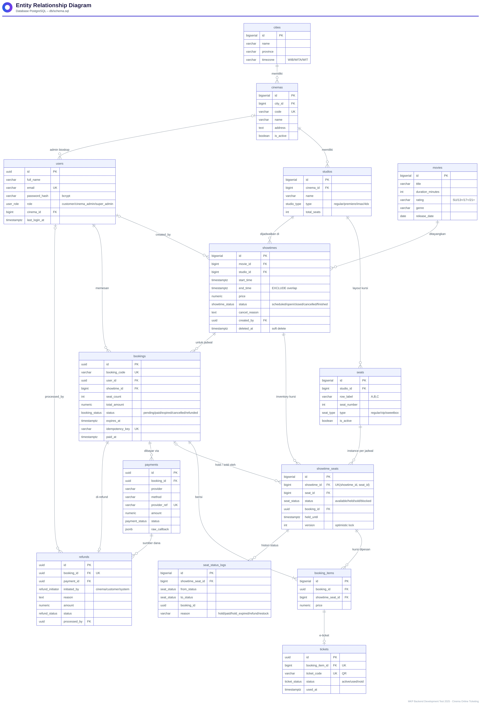

# B. Database Design

Script PostgreSQL: [`db/schema.sql`](../db/schema.sql) (struktur) dan [`db/seed.sql`](../db/seed.sql) (data contoh).

```bash
createdb cinema
psql -d cinema -f db/schema.sql
psql -d cinema -f db/seed.sql
```



## Kelompok tabel

| Kelompok | Tabel | Keterangan |
|---|---|---|
| Lokasi | `cities`, `cinemas`, `studios`, `seats` | Hierarki cabang nasional. `seats` adalah layout fisik kursi per studio. `cities.timezone` dipakai untuk WIB/WITA/WIT. |
| Pengguna | `users` | Role `customer`, `cinema_admin` (terikat ke satu `cinema_id`), dan `super_admin`. Password disimpan dengan bcrypt. |
| Katalog | `movies`, `showtimes` | Jadwal tayang. **Exclusion constraint** `no_overlapping_showtime` mencegah dua jadwal bentrok di studio yang sama. Jadwal dihapus secara soft delete (`deleted_at`). |
| Inventory | `showtime_seats` | 1 baris = 1 kursi pada 1 jadwal. Status `available/held/sold/blocked`, `held_until` untuk batas waktu hold, `version` untuk optimistic lock. `UNIQUE(showtime_id, seat_id)`. |
| Transaksi | `bookings`, `booking_items`, `payments`, `tickets` | `bookings.idempotency_key` mencegah pesanan ganda. `payments.provider_ref` bersifat UNIQUE agar webhook idempotent. `tickets.ticket_code` adalah isi QR code. |
| Refund | `refunds` | `initiated_by` bernilai `cinema/customer/system`. `UNIQUE(booking_id)` mencegah refund ganda. |
| Audit | `seat_status_logs` + trigger `trg_showtime_seats_log` | Histori setiap perubahan status kursi, dicatat otomatis oleh trigger. |
| Laporan | view `v_showtime_availability` | Jumlah kursi available/held/sold/blocked per jadwal. |

## Keputusan desain penting

1. **`showtime_seats` terpisah dari `seats`**: layout kursi adalah template, sedangkan status kursi berbeda untuk setiap jadwal. Dengan pemisahan ini, penguncian cukup dilakukan pada satu baris kecil per kursi, sehingga lock contention rendah.
2. **Jaminan di level database**: `UNIQUE`, `EXCLUDE USING gist`, `CHECK`, dan FK tetap menjaga konsistensi walaupun ada bug di aplikasi atau Redis gagal.
3. **ENUM untuk status** agar nilai status selalu valid dan mudah dibaca.
4. **Partial index** (`WHERE status='held'`, `WHERE status='pending'`) membuat query worker hold-expiry tetap cepat walaupun tabel berukuran besar.
5. **Skalabilitas ke depan**: `showtime_seats`, `seat_status_logs`, dan `bookings` bisa di-*partition* per bulan berdasarkan tanggal tayang. Data yang sudah lewat bisa diarsipkan.
