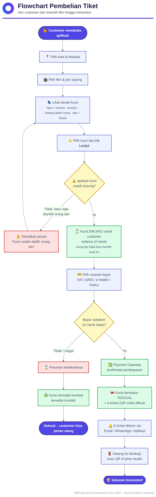
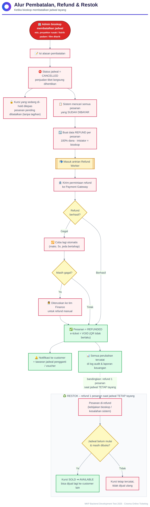
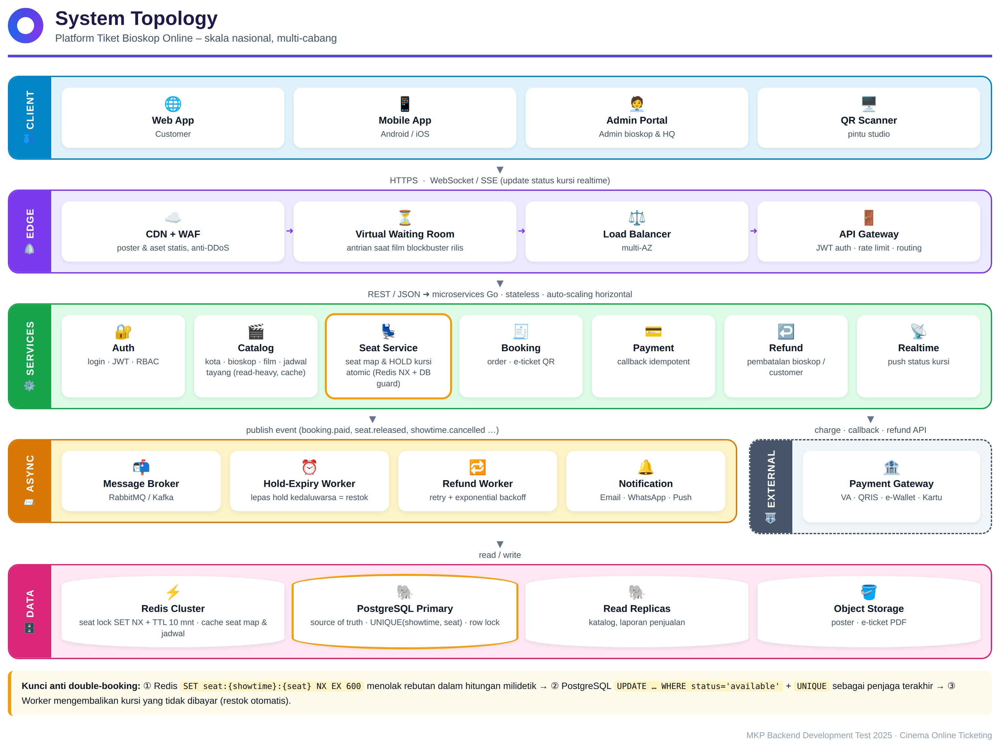

# A. System Design – Platform Tiket Bioskop Online

## Kebutuhan

| Kebutuhan | Artinya bagi sistem |
|---|---|
| Skala nasional, banyak cabang di banyak kota | Data master bertingkat **Kota → Bioskop → Studio → Kursi**. Timezone mengikuti kota (WIB/WITA/WIT). Service stateless yang bisa di-scale horizontal. |
| Transaksi kapan pun secara online | Tersedia 24/7, multi-AZ, pembayaran online lewat Payment Gateway. |
| Kursi yang sudah dipilih **tidak akan dipakai orang lain** | Kursi dikunci secara atomic; tidak mungkin terjadi *double booking* walaupun ribuan orang berebut kursi yang sama. |
| Pencatatan & restok tiket terjual | Setiap perubahan status kursi tercatat. Kursi yang tidak jadi dibayar atau di-refund kembali dijual secara otomatis. |
| Refund / pembatalan dari pihak bioskop | Alur pembatalan jadwal yang otomatis, bisa di-retry, dan tercatat untuk audit. |

---

## 1. Flowchart (untuk orang awam)

### Alur pembelian tiket


### Alur pembatalan oleh bioskop, refund & restok


### Topologi sistem


---

## 2. Solusi

### 2.1 Pemilihan tempat duduk: cepat, aman, dan tahan traffic tinggi

**Model data.** Setiap jadwal tayang punya inventory kursi sendiri di tabel `showtime_seats`: satu baris untuk satu kursi pada satu jadwal, dengan status
`available → held → sold` (atau `blocked`). Baris-baris ini dibuat otomatis saat admin membuat jadwal (lihat API `POST /showtimes`).
Constraint `UNIQUE(showtime_id, seat_id)` memastikan satu kursi hanya punya satu "tiket" per jadwal.

**Menampilkan denah kursi (read, traffic sangat tinggi)**
- Denah kursi per jadwal di-cache di **Redis** (misalnya hash/bitmap `seatmap:{showtime_id}`), sehingga ribuan user yang membuka denah tidak membebani PostgreSQL.
- Perubahan status kursi dipublikasikan lewat message broker ke **Realtime Service** (WebSocket/SSE). Kursi yang baru dipilih orang lain langsung berubah warna di layar user lain, sehingga peluang rebutan kursi berkurang sejak awal.
- Katalog (film, jadwal) dibaca dari **read replica** dan cache, sedangkan aset statis disajikan lewat CDN.

**Mengunci kursi (write, harus konsisten): 2 lapis pengaman**

```
User klik "Lanjut" dengan kursi [A5, A6]
│
├─ ① Redis (gerbang cepat)  — Lua script atomic, all-or-nothing:
│     SET seat:{showtime}:A5 {booking_id} NX EX 600
│     SET seat:{showtime}:A6 {booking_id} NX EX 600
│     └─ salah satu gagal → lepas yang sudah terkunci → "kursi sudah dipilih orang lain"
│
└─ ② PostgreSQL (sumber kebenaran) — 1 transaksi:
      UPDATE showtime_seats
         SET status='held', booking_id=$b, held_until=now()+'10 min'
       WHERE showtime_id=$s AND seat_id = ANY($seats) AND status='available';
      └─ rows_affected ≠ jumlah kursi → ROLLBACK (kursi sudah diambil)
      INSERT bookings(status='pending', expires_at=held_until, idempotency_key) ...
```

- Redis menyaring rebutan dalam hitungan milidetik, jadi hanya satu request per kursi yang sampai ke database. Hasilnya, lock contention di PostgreSQL tetap kecil.
- Klausa `WHERE status='available'` (conditional update yang pada praktiknya berfungsi sebagai row lock) ditambah `UNIQUE` di database adalah pengaman terakhir. **Kalaupun Redis down atau kehilangan data, double booking tetap tidak mungkin terjadi.**
- Kolom `version` di `showtime_seats` mendukung optimistic locking untuk operasi admin (misalnya memblokir kursi yang rusak).
- `idempotency_key` di `bookings` mencegah pesanan ganda ketika user menekan tombol dua kali atau aplikasi mobile melakukan retry.

**Saat traffic sangat tinggi (premiere film blockbuster)**
- **Virtual waiting room** di edge: user masuk antrian dan diizinkan masuk bertahap sesuai kapasitas.
- **Rate limit** per user/IP di API Gateway, misalnya maksimal 6 kursi per transaksi.
- Service Go bersifat stateless dan di-autoscale. Redis Cluster di-shard per `showtime_id`, sehingga beban satu film populer tersebar.

### 2.2 Pembayaran

1. Booking `pending` dibuat bersamaan dengan charge ke Payment Gateway (VA/QRIS/e-wallet), berlaku sampai `expires_at` (10 menit).
2. Payment Gateway mengirim **webhook**. Payment Service memverifikasi signature, lalu memproses secara **idempotent** (berdasarkan `provider_ref`). Dalam 1 transaksi: `payments=success`, `bookings=paid`, `showtime_seats=sold`, dan `tickets` (QR) dibuat.
3. Event `booking.paid` diterbitkan, lalu Notification mengirim e-ticket dan Realtime memperbarui denah kursi.
4. **Pembayaran yang datang terlambat** (sudah lewat `expires_at`): jika kursi masih `available`, sistem mengambil ulang kursi dan pesanan tetap sah. Jika kursi sudah dibeli orang lain, sistem membuat **refund otomatis** (`initiated_by = system`).

### 2.3 Pencatatan & restok tiket

**Pencatatan**
- `showtime_seats` menyimpan status terkini setiap kursi, sehingga kursi terjual per jadwal bisa dihitung dengan cepat lewat view `v_showtime_availability`.
- `seat_status_logs` menyimpan **seluruh histori** perubahan status kursi. Histori ini dicatat otomatis oleh **trigger database**, jadi tidak ada perubahan yang terlewat walaupun update datang dari service atau worker mana pun. Kolom `reason` berisi misalnya `hold`, `paid`, `hold_expired`, `refund`, atau `restock`.
- `bookings`, `booking_items`, `payments`, `tickets`, dan `refunds` membentuk jejak keuangan yang lengkap untuk rekonsiliasi harian dengan laporan Payment Gateway.

**Restok (kursi kembali dijual)**

| Kejadian | Aksi | Status kursi |
|---|---|---|
| User tidak membayar dalam 10 menit | **Hold-Expiry Worker** (berjalan tiap ±30 detik, plus TTL Redis) menjalankan `UPDATE … SET status='available' WHERE status='held' AND held_until < now()`. Booking menjadi `expired`. | `held → available` |
| Pembayaran gagal atau user membatalkan sebelum bayar | Kursi langsung dilepas | `held → available` |
| Pesanan yang sudah dibayar di-refund, sedangkan **jadwal tetap tayang** dan belum dimulai | Tiket di-`void`, kursi dijual kembali | `sold → available` |
| Jadwal **dibatalkan** oleh bioskop | Kursi **tidak** direstok karena jadwalnya tidak ada lagi | `→ blocked` |
| Kursi rusak | Admin memblokir kursi tersebut | `available → blocked` |

Semua perubahan di atas tercatat di `seat_status_logs`. Setiap perubahan juga menerbitkan event `seat.released`, sehingga cache Redis dan denah kursi user lain langsung ikut ter-update.

### 2.4 Refund / pembatalan dari pihak bioskop

1. Admin bioskop membatalkan jadwal dan mengisi alasannya (`showtimes.status = 'cancelled'`, `cancel_reason`). Penjualan untuk jadwal tersebut **langsung berhenti**.
2. Dalam 1 transaksi:
   - Semua kursi `held` dilepas dan booking `pending` menjadi `cancelled` (belum ada uang yang ditagih).
   - Untuk setiap booking `paid`, dibuat baris `refunds` (`initiated_by='cinema'`, 100% dari nominal, status `requested`). Constraint `UNIQUE(booking_id)` di tabel `refunds` mencegah satu pesanan di-refund dua kali.
3. Event `showtime.cancelled` masuk ke antrian. **Refund Worker** memanggil API refund Payment Gateway untuk setiap refund.
   - Jika berhasil: `refunds=success`, `bookings=refunded`, `tickets=void` (QR ditolak oleh scanner di pintu studio), `payments=refunded`.
   - Jika gagal: retry dengan exponential backoff (maksimal 5 kali). Jika masih gagal, refund masuk **antrian manual tim Finance**, dan statusnya tetap terlacak di dashboard.
4. Customer menerima notifikasi (Email/WA/Push) berisi status refund dan tawaran jadwal pengganti atau voucher.
5. Semua langkah tercatat (`refunds.processed_by`, `processed_at`, `seat_status_logs`) sehingga bisa diaudit.

**Aturan di API CRUD jadwal** (sudah diimplementasikan): jadwal yang sudah memiliki kursi `held`/`sold` **tidak bisa dihapus** dan film/studio/jam tayangnya **tidak bisa diubah** (API mengembalikan 409). Admin wajib memakai alur pembatalan & refund di atas agar uang customer terlindungi.

---

## 3. Teknologi

| Layer | Pilihan | Alasan |
|---|---|---|
| Service | Go | Konkurensi ringan dan latensi rendah; sesuai syarat test |
| Database | PostgreSQL | ACID, row lock, exclusion constraint (anti jadwal bentrok), JSONB |
| Cache / lock | Redis Cluster | `SET NX EX` atomic, TTL untuk hold, cache seat map |
| Broker | RabbitMQ / Kafka | Proses async (notifikasi, refund, realtime) yang dapat di-retry |
| Realtime | WebSocket / SSE | Update denah kursi secara langsung |
| Observability | Prometheus + Grafana, log terstruktur (JSON), tracing | Memantau hold rate, payment success rate, dan refund backlog |
